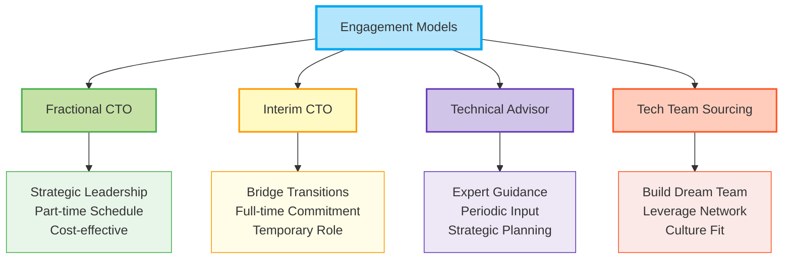
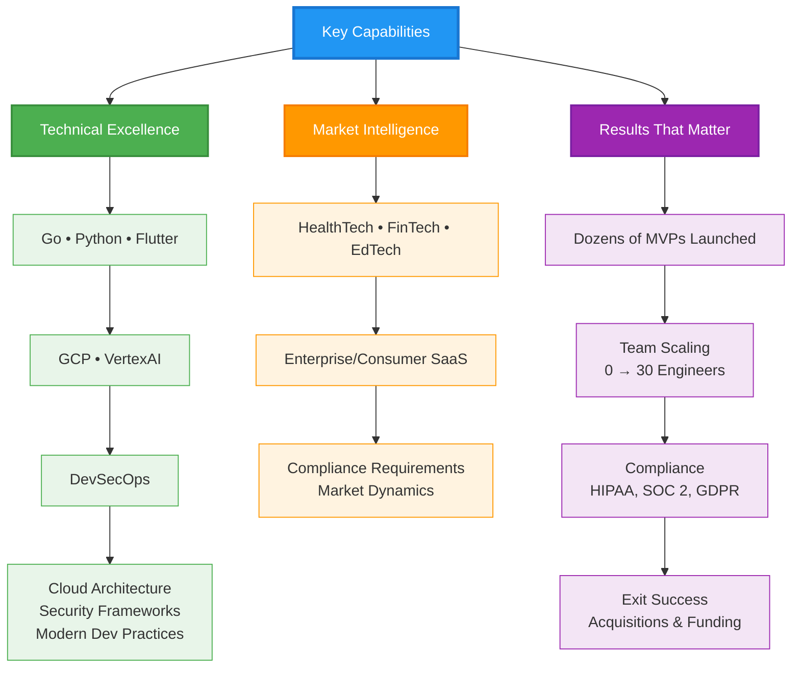

## Leadership style

As a Managing Partner & Fractional CTO at <a href="https://aliveness.ventures" target="_blank" rel="noopener noreferrer">Aliveness Ventures</a>, I collaborate with founders and CEOs to turn vision into compliant, revenue-ready product quickly. My style blends psychological safety with radical candor: the team feels safe to question and experiment, yet we challenge assumptions early so we can iterate fast.

Every decision starts with the user and hard data, favoring simple, well-documented architectures that scale gracefully and remain easy to maintain while meeting the highest security and privacy bars. I automate the rote, instrument quality, and run transparent, continuous release cadences that keep momentum high and surprises low.

Drawing on two decades of experience building tech behind successful exits, delivering dozens of MVPs, and scaling fully remote teams from 0 → 30, I bring calm, business-savvy guidance that aligns technology roadmaps with growth goals, uplifts morale, and frees founders to focus on customers and capital rather than firefighting.

## Engagement models

## What leaders say

  

    

      <blockquote>
        
"Keolo really grasps the big picture with his high business acumen. He's also an excellent manager of people and continually puts the needs of his team first. He's an extremely thoughtful leader who is approachable, always seeking feedback, and super easy to work with.

 
Keolo brings a calm presence and a positive outlook to his work even in hectic situations. His contributions tend to uplift those around him and have been instrumental in maturing the company through a time of rapid growth."

        
<strong>— Engineering Director; Stephanie K., HealthTech, Series B</strong>

      </blockquote>
    

    

      <blockquote>
        
"I'm happy to recommend Keolo for his exceptional engineering skills and leadership abilities. As a Technical Engineering Manager, Keolo was an integral part of the team that built our innovative FinTech platform.

        
Keolo is an outstanding problem solver, and he has a keen eye for detail that helped him quickly identify and resolve technical challenges. He communicated technical concepts clearly, making it easy for the team to understand.

        
Keolo was also crucial in managing our diverse team of engineers, fostering a culture of collaboration, and ensuring everyone worked together towards the same goal. He was always professional, dedicated to his work, and willing to go the extra mile to deliver results.

        
I highly recommend Keolo for any technical engineering role. He is a talented and passionate engineer who can make a valuable contribution to any organization."

        
<strong>— CTO; Bhavish B., FinTech, Series A</strong>

      </blockquote>
    

    

      <blockquote>
        
"I collaborated with Keolo for a year at a FinTech startup; he led the Tech team and I led Product. We met every day. Keolo applies a fresh, can-do approach to every potential project. He leads his team in a way that gives each person room to grow and contribute their best to a project.

 
Together, we built a repeatable delivery model based on weekly releases that was very successful. Keolo will be a great fit to lead a Technology team and increase your speed of delivery!"

        
<strong>— Head of Product; Jeff E., FinTech, Series A</strong>

      </blockquote>
    

    

      <blockquote>
        
"We have worked with Keolo for a long time. You can depend on the quality work that he does. When you work with Keolo, you are also getting the benefit of a developer with an eye for design.

 
We enjoy working with him and will continue to do so. He is reliable and trustworthy."

        
<strong>— VP, Board of Directors; Holly H., Charter School</strong>

      </blockquote>
    

    

      <blockquote>
        
"Keolo surpassed my expectations. I interviewed four web development firms, and am very glad I chose to go with him. Keolo's product was creative, has great functionality, and looks amazing. He understood our needs and our vision, and was very good about staying on-budget and on-time.

 
I will definitely use him and his team for my future development needs, and would recommend Keolo to anyone."

        
<strong>— Partner; Gary M., Premier Business Law Firm</strong>

      </blockquote>
    

  

  
  <button class="testimonial-carousel-btn testimonial-carousel-prev" onclick="changeTestimonialSlide(-1)">&#10094;</button>
  <button class="testimonial-carousel-btn testimonial-carousel-next" onclick="changeTestimonialSlide(1)">&#10095;</button>
  
  

    
    
    
    
    
  

## Key capabilities

## Let's build something great

Ready to transform your technical vision into market reality? I help founders navigate the complex journey from idea to scale with battle-tested strategies and hands-on leadership.

**<a href="https://calendar.app.google/rVk4MYXfZTu6VHdP9" target="_blank" rel="noopener noreferrer">Schedule a conversation →</a>**

---

*Turning ambitious visions into compliant, scalable, revenue-generating products since 2005.*
