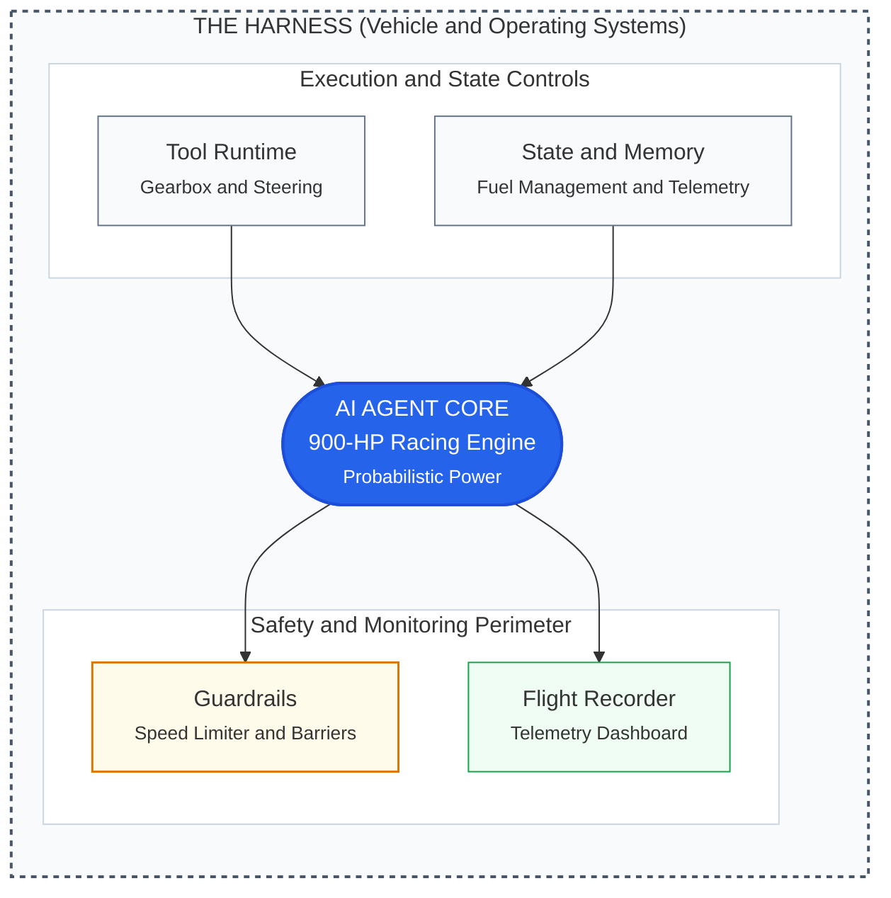
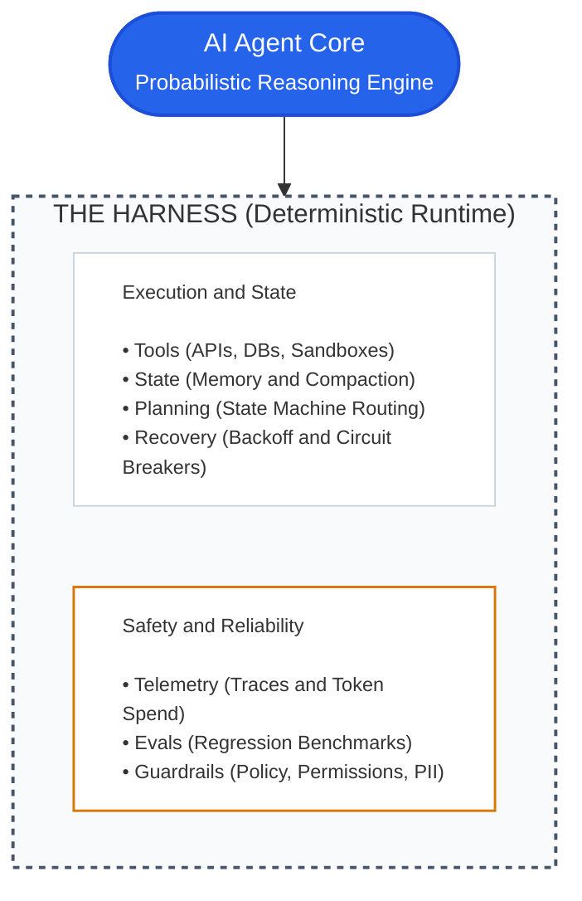
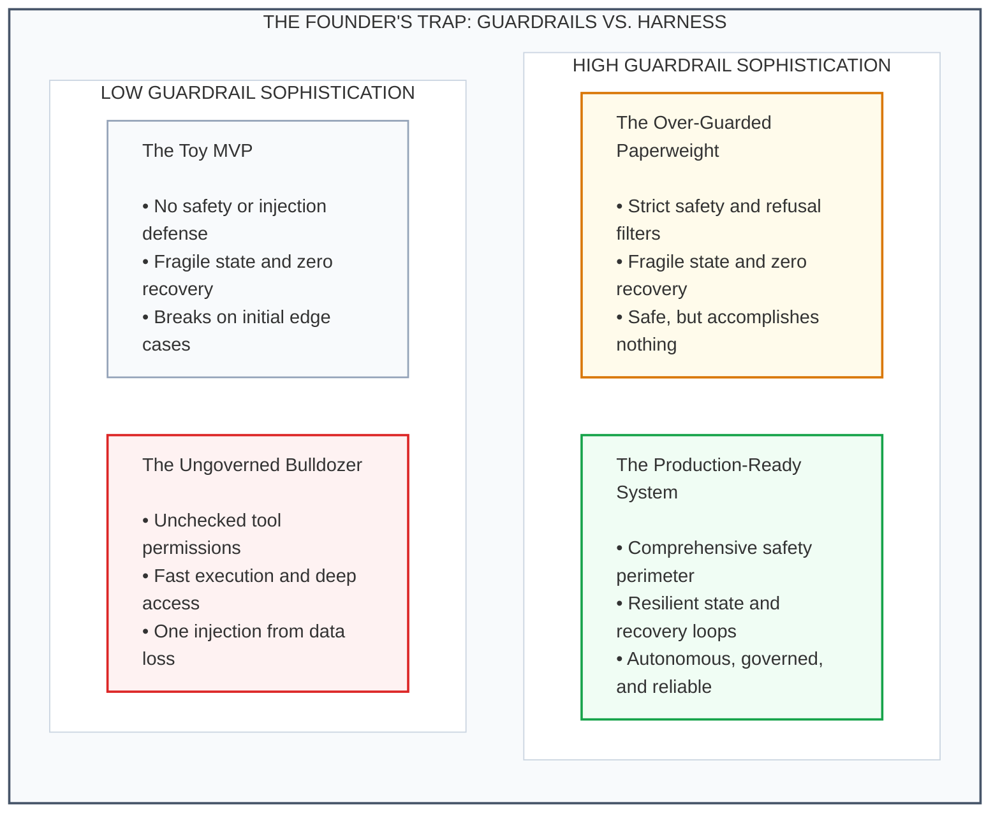

If you are a founder building with AI, you have probably heard "guardrails" and "harnesses" as interchangeable buzzwords.

They are not, and confusing them burns seed runway fast.

Guardrails tell an AI what it must never do. A harness is the machinery that allows it to finish real work.

Demos look flawless with clean prompts. Production is ruthless. When an agent triages support tickets, issues refunds, or queries databases, your 3:00 AM outages are almost never prompt errors. They are failures in the unglamorous plumbing around the model.

You do not need an engineering background to know whether your product will survive real users. You just need to understand the difference between the brakes and the chassis.

---

## The race car analogy

Consider a simple physical model:

Your underlying Large Language Model is a 900-horsepower racing engine. It converts input into output at high speed, but it has no steering, no fuel line, and no driver seat.

* **Guardrails** are the steel barriers around the track and the pit-lane speed limiter. Their job is negative constraint: keep the car from flying into the grandstands and stop the car from speeding near mechanics.
* **The harness** is everything else required to turn that engine into a controllable race car: the chassis, steering rack, sequential gearbox, suspension, fuel management system, telemetry sensors, and the physical seatbelts holding the driver in place.

The hierarchy matters: guardrails are a single component inside the harness.

If you build guardrails without a harness, you have bolted crash barriers around an engine bolted to a wooden bench. It will never crash, but it cannot run a single lap.

---

## Comparing harnesses and guardrails

To understand where your engineering budget goes, compare their responsibilities directly:

| Dimension | AI Guardrails | The AI Harness |
| :--- | :--- | :--- |
| **Primary job** | Negative constraint: what the agent must never do | Operational capability: how the agent completes work reliably |
| **Scope** | Narrow: input/output filters, policy evaluation, schema validation | Broad: execution runtime, state machines, tool calling, error recovery |
| **Mental model** | Fences, locks, and alarms | Chassis, engine controls, and nervous system |
| **Common tools** | NeMo Guardrails, Llama Guard, Guardrails AI, regex filters, PII sanitizers | Temporal, LangGraph, custom state machines, sandbox containers, Redis, OpenTelemetry |
| **Problem solved** | The model outputs patient health data or complies with a prompt injection | An API times out on step 4 of 7, context drops, and the agent begins hallucinating |
| **Day-to-day rule** | "Reject inputs containing SQL drop commands; block toxic text." | "Retry Stripe API calls with backoff; compact memory at 80k tokens; pause for human review over $500." |

---

## What an agent harness looks like

When an AI model executes multi-step work, it never talks directly to your database, your payment gateway, or your users. It runs inside a deterministic software wrapper:

Without a harness, an LLM is a conversational prompt tool.

The harness supplies the database connectors, external API clients, session persistence, and error handling that turn raw text generation into functioning software.

---

## Five pillars of a production-grade harness

Prompting the model consumes about 10% of your team's engineering hours. The remaining 90% goes toward these five architectural pillars:

### 1. State persistence and context compaction
Models have finite context windows, and performance degrades when inputs get too large. A simple system dumps every API response straight into the prompt until token limits trigger an error or generate huge API bills.

A production harness treats conversation history as a structured state machine. It condenses completed steps, evicts transient payload data, and retains core user intent while keeping token volume stable.

### 2. Tool execution, idempotency, and sandboxing
Allowing an agent to call external services (`refund_charge`, `delete_record`, `send_email`) requires strict execution safeguards.

If an external payment gateway times out after 10 seconds, did the transaction succeed? An agent without a harness will retry the tool, charging the customer a second time. A robust harness injects unique idempotency keys, runs destructive operations in sandbox containers, and checks database state before attempting retries.

### 3. Execution governors and loop breakers
Agents often get trapped in recursive loops. When an API returns a schema validation error, an unguarded agent will repeatedly send the same malformed request dozens of times.

Guardrails will not catch this because each individual call appears safe. The harness must enforce hard iteration limits, pattern detectors for repeating errors, and spend caps that shut down stuck threads automatically.

### 4. Human-in-the-loop checkpoints
Unchecked autonomy is rarely appropriate for financial or operational workflows. A reliable harness models human review as a normal asynchronous state:

1. The agent drafts an action, such as a wire transfer or database migration.
2. The harness freezes execution and serializes the workflow state to a database.
3. It sends a Slack notification or webhook to the review queue.
4. When a human approves or edits the request, the harness restores the execution stack and resumes the job.

### 5. Flight recorder telemetry and deterministic evals
When an agent fails, you cannot inspect a standard stack trace. The model did not crash; it simply made a flawed deduction.

The harness records the full session: prompts, tool payloads, token consumption, latency, and reasoning traces. That record lets your team replay production failures locally against evaluation test suites whenever you modify system instructions or change models.

---

## Production case studies: where guardrails fail

These three production issues illustrate why safety filters cannot compensate for missing harness infrastructure:

### 1. The $2,400 retry loop
A seed-stage fintech startup deployed an agent to categorize disputed credit card charges. The prompt included strict guardrails against data leakage and injection attacks.

During an early morning run, an upstream banking API threw a 429 rate-limit error. Without exponential backoff or turn limits in the harness, the agent immediately retried the request. It looped 8,000 times in 40 minutes, burning through thousands of dollars in tokens while the bank blocked the company's IP address. The guardrails functioned perfectly: not a single policy was violated while the company burned capital.

### 2. The double refund
An e-commerce returns agent was configured to process customer refunds and restock items.

A network interruption occurred during a POST request to Shopify. The connection dropped before the confirmation payload arrived. Because the harness lacked idempotency handling, the agent saw the failure and initiated a retry. The customer received two refunds for one return. The output text was polite and compliant, but the accounting ledger was broken.

### 3. Context compaction amnesia
A legal-tech agent was set up to analyze 70-page commercial leases and highlight non-standard liabilities.

The accumulated tool responses exceeded 120,000 tokens. The engineers lacked a summarization pipeline, so their runtime simply truncated the earliest messages in the prompt buffer. The model lost the user's initial instructions and began generating standard boilerplates instead of identifying the anomalies requested in step one.

---

## The founder's trap: paperweights vs. bulldozers

Teams usually drift toward one of two operational mistakes:

### The over-guarded paperweight (High Guardrails, Low Harness)
The team adds layers of semantic firewalls, toxicity filters, and refusal classifiers, but the runtime lacks session persistence or error recovery. The agent never causes a public relations incident, but it repeatedly drops sessions, loses user context, and fails on multi-step workflows.

### The ungoverned bulldozer (Low Guardrails, High Harness)
Engineers build fast asynchronous queues, deep database integrations, and reliable retry logic, but skip input sanitization and privilege boundaries. The agent executes tasks quickly until a malicious or malformed input tricks it into updating production records or emailing customers unvetted text.

---

## Five questions to ask your tech lead on Monday

You can evaluate the stability of your agent architecture without inspecting code. Use these five questions in your next engineering meeting:

1. **"What happens if an external API times out on step 5 of a 6-step task?"**
   * Red flag: "The model will see the error in the prompt and figure out what to do."
   * Good answer: "The harness catches the timeout, runs an exponential backoff for up to three attempts, and saves state to our database if it fails so a human can intervene."

2. **"How do we prevent duplicate transactions if an agent retries an API call?"**
   * Red flag: "We told the LLM in the system prompt to only run the tool once."
   * Good answer: "Every state-modifying tool call uses deterministic idempotency keys and verifies database state before executing."

3. **"What stops the agent if it gets stuck in a loop?"**
   * Red flag: "Our HTTP server has a general timeout."
   * Good answer: "The harness enforces a maximum of 15 tool steps and a $2.00 token ceiling per run before halting the process."

4. **"How do we handle tasks that require hours of waiting for human approval?"**
   * Red flag: "We keep the background process running."
   * Good answer: "The harness serializes the workflow state to disk, suspends execution, and wakes back up when the webhook callback fires."

5. **"When a customer reports an unexpected output, can we replay the exact run?"**
   * Red flag: "We have basic API logs in our monitoring tool."
   * Good answer: "The harness captures step traces, tool inputs, and model responses so we can run deterministic regression tests."

---

## The bottom line

Guardrails are the constraints that keep an AI within acceptable boundaries. The harness is the machinery that makes the system capable of useful work.

Putting guardrails on an agent without a harness is like bolting safety glass onto a vehicle that has no transmission or steering. It will never cause an accident, but it will never leave the garage.

When reviewing your AI product architecture, ask about guardrails, but verify the harness first.
