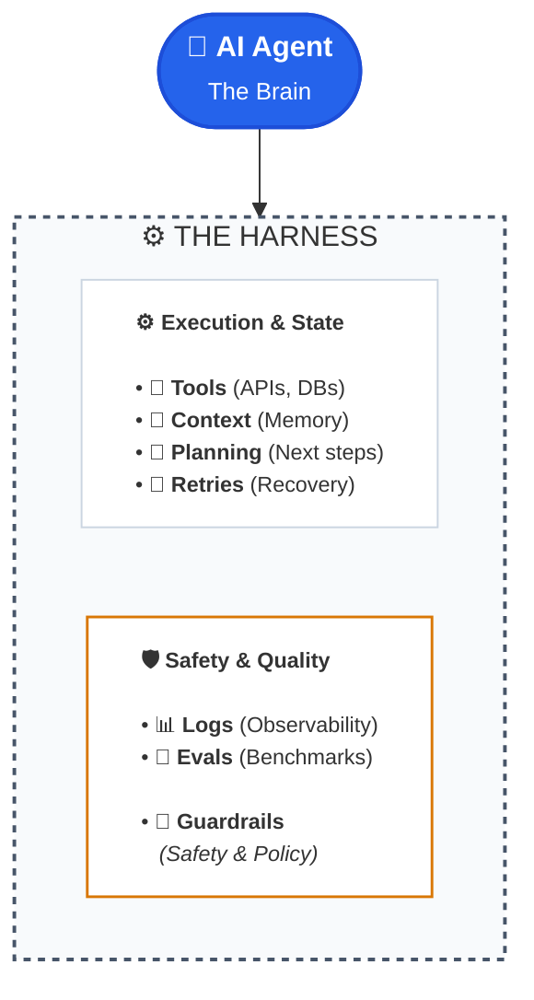

If you’re a less-technical founder building an AI startup today, you’ve probably heard your engineers toss around two buzzwords as if they were interchangeable: **guardrails** and **harnesses**.

They aren’t the same thing.

Conflating them isn’t just a matter of semantics—it’s the fastest way to blow through runway building an AI agent that is either dangerously unhinged or so heavily restricted it can’t do its job.

Here is the plain-English breakdown of what these terms actually mean, why the distinction matters to your product roadmap, and how to talk about them with your technical team.

---

## The Race Car Analogy

Before diving into system architecture, let’s look at a simple mental model:

Imagine your underlying Large Language Model (LLM) is a **500-horsepower racing engine**. Raw, fast, and completely incapable of steering itself without an entire vehicle built around it.

* **The Harness** is the **entire racing setup**: the chassis, the steering wheel, the gearbox, the telemetry dashboard, the pit crew, the fuel management strategy, and the physical safety harness strapped around the driver. It’s the complete operating machine that turns raw combustion into a lap time.
* **The Guardrails** are the **steel barriers on the corners and the pit-lane speed limiter**. They exist for one specific job: preventing catastrophic crashes when things go sideways.

Notice the hierarchy: **Guardrails are just one piece of the harness.**

---

## Harness vs. Guardrails: The Cheat Sheet

| Feature | The AI Harness | The AI Guardrails |
| :--- | :--- | :--- |
| **What it is** | The surrounding system that makes an AI agent useful, reliable, and controllable | The specific rules and filters that constrain what the agent is allowed to do |
| **Scope** | **Broad** (Infrastructure & Orchestration) | **Narrow** (Safety, Policy & Boundaries) |
| **Primary Focus** | Execution, tool calling, memory, retries, cost tracking, observability | Policy enforcement, permissions, input/output validation, safety checks |
| **Mental Model** | **The operating environment** | **The fences and limits** |
| **What it sounds like** | *“Run the search tool, retry twice if the API fails, log the token cost, and ping Slack for review.”* | *“Never send an email without user approval; redact all social security numbers.”* |

---

## What Does an Agent Harness Actually Look Like?

When an AI model attempts to execute complex workflows—like triaging customer support tickets, reconciling invoices, or researching leads—it doesn’t just sit in a chat box.

It lives inside a software wrapper. That wrapper is your **harness**:

Without a harness, an LLM is just text in, text out.

The harness is what gives the model hands to touch your database, eyes to read your metrics, and a memory to remember what it did three steps ago.

---

## Why "Harness"

Early generative AI applications were simple wrappers around a prompt: you typed a query, the model responded, and you rendered the markdown.

Today’s products are **agentic**. They take multi-step actions across your infrastructure. The model itself is no longer the product; **the infrastructure wrapped around it is.**

When your engineering team is building an agent, they spend roughly 10% of their time prompting the model and 90% solving harness questions:

1. **Tool Access:** Which specific APIs can the model call? How does it authenticate without leaking private API keys?
2. **Context & State:** What prior data does it need to remember, and what should be pruned to keep API bills low?
3. **Execution Limits:** How many loops can it take before we kill the process so it doesn't run up a $500 bill on a single infinite loop?
4. **Resilience:** If an external tool throws a `504 Gateway Timeout`, does the agent crash, or does it try an alternate route?
5. **Human-in-the-Loop:** At what point does the machine stop and say, *"A human needs to click 'Approve' before I wire this money"*?
6. **Observability:** How do we trace the exact thought process that led to a bad output?

**Guardrails** fit inside this machinery as the policing layer. They inspect inputs to block prompt-injection attacks, validate outputs to catch hallucinations, and enforce business rules before any tool fires.

---

## The Founder's Trap: Building One Without the Other

Understanding this distinction will save you months of misdirected engineering effort:

* **If you build guardrails without a proper harness:** You get an exceptionally safe, compliant system that accomplishes nothing. It won’t hallucinate toxic text, but it will drop sessions, choke on API failures, forget customer details, and fail to finish multi-step workflows.
* **If you build a harness without guardrails:** You get a lightning-fast, highly capable engine that will eventually delete a customer’s production database because a prompt injection told it to.

---

## The Bottom Line

If you need a single takeaway to keep in your back pocket for your next product sync:

> **A harness is the machinery for running and controlling an AI agent; guardrails are the constraints that keep that machinery within acceptable bounds.**

Next time your engineering lead presents an AI agent architecture, don't just ask: *"What guardrails do we have in place?"*

Ask: ***"How robust is our harness when things break?"***
