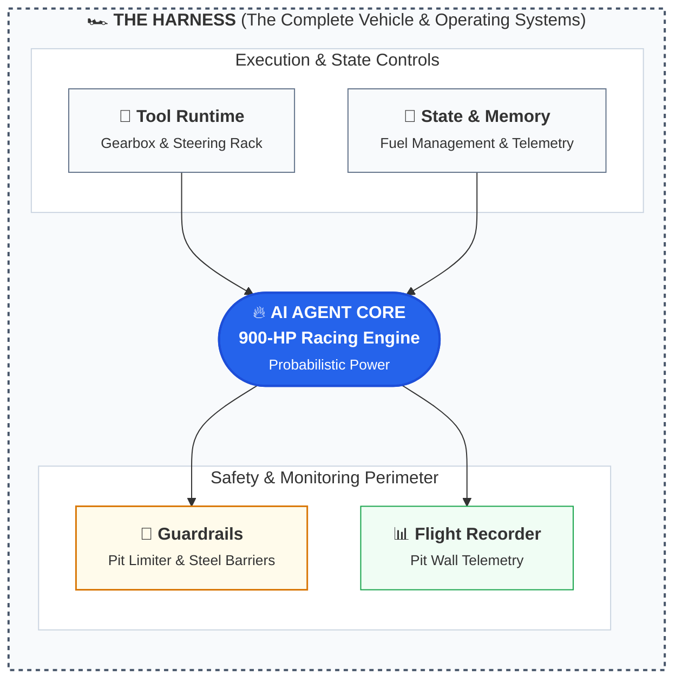
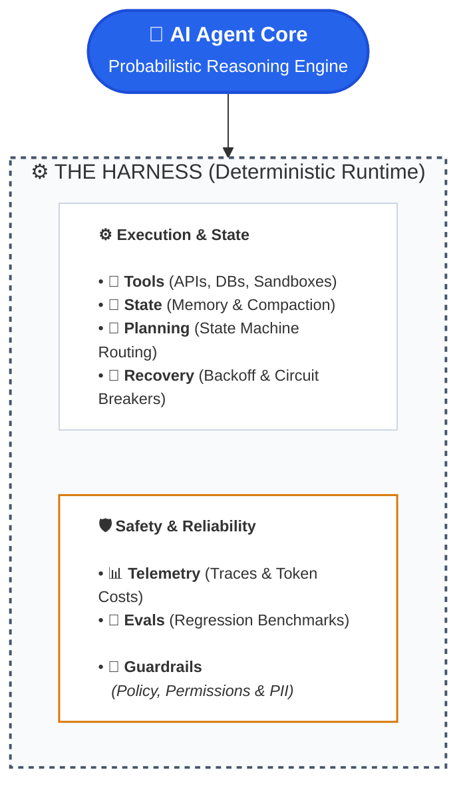
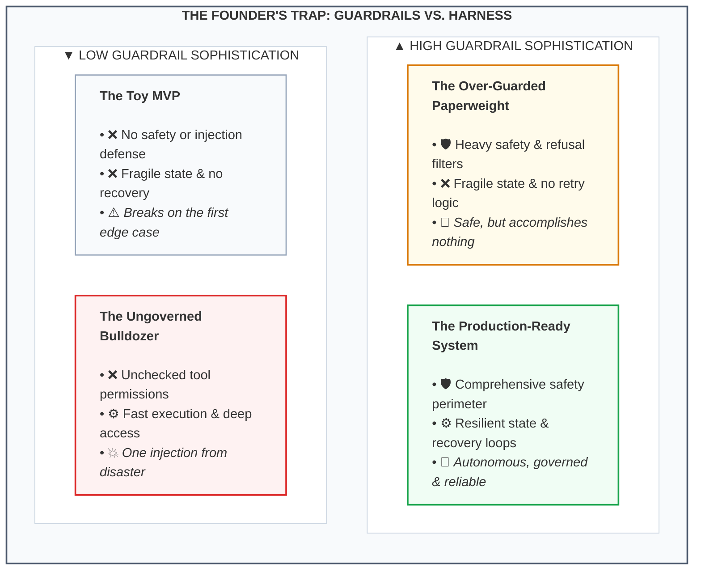

If you are an early-stage founder building an AI startup today, you’ve probably heard your engineers toss around two buzzwords as if they were interchangeable: **guardrails** and **harnesses**.

They aren’t the same thing.

Conflating them isn’t just an academic debate—it is one of the fastest ways to vaporize seed capital. You will end up building an AI agent that is either a **neutered paperweight** (so over-guarded it refuses to do real work) or an **ungoverned bulldozer** (lightning-fast, but prone to wiping a customer database because an upstream API threw an unexpected 500).

Every seed demo looks miraculous when an engineer prompts an LLM in a local terminal. But when that agent hits production—triaging customer support tickets, reconciling ledger entries, or executing SQL queries—90% of the failures that wake you up at 3:00 AM have nothing to do with the prompt. 

They are harness failures.

Here is the plain-English breakdown of what these terms mean, why the distinction determines whether your startup survives contact with reality, and the exact questions to ask your technical team on Monday.

---

## The Race Car Analogy

Before looking at software architecture, consider a simple physical model:

Imagine your underlying Large Language Model (whether it's Claude 3.5 Sonnet, GPT-4o, or Gemini 1.5 Pro) is a **900-horsepower Formula 1 engine**. It is raw, violent, probabilistic power. It converts fuel into speed at breathtaking velocity. 

* **The Guardrails** are the **steel barriers on the track edges and the pit-lane speed limiter**. Their sole purpose is negative constraint: keeping the car from plunging into the grandstand and preventing the driver from speeding where mechanics are walking.
* **The Harness** is **everything else that turns that engine into a controllable, winning race car**: the carbon-fiber monocoque chassis, the steering wheel and paddle shifters, the active suspension, the telemetry sensors streaming 1,000 data points per second to the pit wall, the fire suppression system, the pit crew's refueling strategy, and the 6-point safety belt physically strapping the driver to the seat.

Notice the crucial hierarchy: **Guardrails are just one subsystem inside the harness.**

If all you build are guardrails, you have bolted steel barricades around an engine sitting on a wooden bench. It won't crash into a wall, but it will never complete a lap.

---

## Harness vs. Guardrails: The Definitive Comparison

To understand where your engineering hours are actually going, compare their core responsibilities side-by-side:

| Dimension | The AI Guardrails | The AI Harness |
| :--- | :--- | :--- |
| **Primary Mandate** | **Negative constraint**: What the agent must *never* do | **Operational capability**: How the agent reliably *accomplishes* work |
| **Architectural Scope** | **Narrow**: Input/output filters, policy evaluation, schema validation | **Broad**: Execution runtime, state management, tool calling, fault recovery |
| **Mental Model** | The fences, locks, and security alarms | The chassis, engine controls, and nervous system |
| **Common Technologies** | NeMo Guardrails, Llama Guard, Guardrails AI, regex sanitizers, PII filters | LangGraph, Temporal, custom state machines, sandbox containers, Redis, OpenTelemetry |
| **Typical Problem Solved** | *"The model tried to output confidential HIPAA patient data or fell for a prompt injection."* | *"The CRM API timed out on step 4 of 7, the session lost state, and the agent began hallucinating."* |
| **What It Sounds Like** | *"Reject prompts containing SQL drop commands; block toxic replies."* | *"Retry Stripe API calls with exponential backoff; compact memory at 80k tokens; pause for human sign-off on charges over $500."* |

---

## What Does an Agent Harness Actually Look Like?

When an AI model executes multi-step workflows, it never interacts directly with your database, your payment gateway, or your customers. 

It lives entirely inside a deterministic software wrapper:

Without a harness, an LLM is a conversational novelty: text in, text out.

The harness gives that model **hands** to invoke external services, **eyes** to inspect database records, a **memory** to persist context across distributed sessions, and **reins** to hold it accountable.

---

## The 5 Pillars of a Production-Grade AI Harness

Why is "harness engineering" dominating discussions across frontier AI labs and seed-stage startups alike?

Because prompting the model represents roughly **10% of the engineering workload**. The remaining 90% is spent wrestling with the five foundational pillars of the harness:

### 1. State Persistence & Context Compaction
LLMs have fixed context windows and suffer from "lost-in-the-middle" attention degradation. A naive system dumps every raw tool response into the prompt until it explodes the context window or runs up a staggering token invoice. 

A resilient harness manages conversation history as a structured state machine. It uses selective eviction, rolling summaries, and semantic retrieval to ensure the model retains critical user intents while trimming ephemeral noise.

### 2. Tool Execution, Idempotency & Sandboxing
Giving an AI agent access to write tools (like `refund_charge`, `delete_record`, or `send_email`) is terrifying without an execution boundary. 

If an external payment gateway returns a `504 Gateway Timeout`, did the charge go through or not? A naive agent will simply retry the tool—accidentally charging a customer twice. A robust harness enforces **idempotency keys**, executes unsafe side-effects in isolated sandbox environments, and verifies database state before repeating actions.

### 3. Execution Governors & Loop Breakers
Agents are notorious for falling into self-referential cognitive traps. An API returns a schema validation error, and the agent attempts the exact same malformed request 45 times in a row.

Guardrails will not save you here because every single API call looks completely benign. The harness must implement **execution governors**:
- Hard caps on maximum step iterations.
- Deadlock and loop-detection heuristics.
- Real-time token burn budgets that automatically terminate zombie threads.

### 4. Human-in-the-Loop (HITL) Checkpoints
Full autonomy is almost always a product anti-pattern in high-stakes B2B workflows. A production harness treats human oversight not as a fallback error handler, but as a first-class asynchronous state:
- The agent prepares an action (e.g., draft wire transfer, generate custom SQL script).
- The harness suspends execution and persists the state machine to a durable database.
- It triggers a webhook or Slack notification requesting human verification.
- Once the human clicks "Approve" or modifies parameters, the harness re-hydrates the agent's exact execution stack and continues.

### 5. Flight Recorder Telemetry & Deterministic Evals
When an agent hallucinates in production, you cannot debug it with a standard stack trace. The model did not throw a syntax error; it simply made a bad semantic deduction.

The harness acts as a **black-box flight recorder**. It captures every prompt iteration, tool payload, token count, latency metric, and internal reasoning trace. This enables you to replay production failures deterministically against local evaluation suites (`evals`) whenever you adjust model weights or system prompts.

---

## Real Production War Stories: Why Guardrails Alone Fail

To see why guardrails without a harness are useless, look at three common production disasters:

### War Story 1: The $2,400 Infinite Loop
> **The Setup:** A seed-stage fintech startup deployed an agent with rigorous guardrails to categorize disputed credit card transactions. The prompt was heavily filtered against PII leaks and prompt injection.  
> **The Breakdown:** An upstream bank API returned a rate-limit error (`429 Too Many Requests`). With no exponential backoff or loop breaker in the harness, the agent reasoned: *"The bank didn't answer; let me ask again immediately."*  
> **The Consequence:** It pinged the API 8,000 times in 40 minutes, burning through thousands of dollars in input tokens while clogging the company’s IP on the bank's firewall. The guardrails were thrilled: not a single policy violation occurred.

### War Story 2: The Double Refund Disaster
> **The Setup:** An e-commerce returns agent was tasked with validating return criteria and issuing store credits.  
> **The Breakdown:** A network blip occurred exactly during the POST request to the Shopify API. The connection dropped before the confirmation payload returned.  
> **The Consequence:** Because the harness lacked idempotency controls and transaction reconciliation, the agent retried the command and credited the user twice. Safe text output; broken accounting balance.

### War Story 3: Context Compaction Amnesia
> **The Setup:** A legal-tech research agent was asked to review a 70-page merger agreement and redline non-standard indemnification clauses.  
> **The Breakdown:** The raw tool responses filled 120,000 tokens of context. The engineering team had no intelligent summarization layer, so their naive harness simply chopped off the top half of the prompt when token limits approached.  
> **The Consequence:** The model forgot the user’s original prompt instructions from step 1 and hallucinated standard clauses into non-existent sections.

---

## The Founder’s Trap: The Paperweight vs. The Bulldozer

As a non-technical founder or product leader, understanding this dichotomy protects you from two fatal engineering traps:

1. **The Over-Guarded Paperweight (High Guardrails, Low Harness):**  
   Your team installs multiple layers of safety filters, semantic firewalls, and refusal classifiers. But the runtime lacks robust state management, retry logic, or error recovery. The result is an agent that never causes a PR scandal, but constantly stalls, loses customer context, and gives up on multi-step workflows. Customers churn because the product is useless.

2. **The Ungoverned Bulldozer (Low Guardrails, High Harness):**  
   Your engineers build brilliant tool orchestrators, fast asynchronous pipelines, and deep database integrations. But they skip prompt injection defenses, input sanitization, and output bounds. The result is an agent that executes complex workflows with blazing speed—until a malicious user embeds a prompt injection in a support ticket that tricks the agent into dropping tables or emailing the entire customer roster.

---

## 5 Questions Every Founder Should Ask Their Tech Lead on Monday

You don't need a computer science degree to evaluate whether your startup's AI architecture can survive real users. Bring these five questions to your next engineering sync:

1. **"What happens to the agent’s execution stack if an external API times out on step 5 of a 6-step task?"**  
   *Bad answer:* "The model will see the error and figure out what to do."  
   *Good answer:* "Our harness captures the timeout, triggers an exponential backoff with a maximum of three retries, and if it still fails, saves state and escalates to a human queue."

2. **"How do we guarantee the agent won't execute the same destructive tool twice during a network retry?"**  
   *Bad answer:* "We instructed the LLM in the system prompt to only execute it once."  
   *Good answer:* "All write tools generate deterministic idempotency keys and verify state before execution."

3. **"What is our hard stop if an agent gets caught in an execution loop?"**  
   *Bad answer:* "We have high timeout limits on our server."  
   *Good answer:* "Our harness enforces a hard limit of 15 tool turns and a $2.00 token spend ceiling per run before automatically killing the thread."

4. **"How do we preserve state when a human approval step takes 18 hours?"**  
   *Bad answer:* "We keep the server process open in memory."  
   *Good answer:* "The harness serializes the workflow state machine to our database and halts execution until the approval webhook fires."

5. **"When a user reports that an agent made a bad decision, can we replay the exact sequence of reasoning and tool outputs that caused it?"**  
   *Bad answer:* "We have basic API logs in Datadog."  
   *Good answer:* "Yes, our harness logs every step trace, tool payload, and model input into our evaluation suite so we can run deterministic regression tests."

---

## The Bottom Line

Keep this mental model in your back pocket for your next board deck or architecture review:

> **Guardrails are the constraints that keep your AI within acceptable boundaries; the harness is the machinery that makes your AI capable of doing real work.**

Building guardrails without a harness is like putting bulletproof glass on a car that doesn't have an engine or wheels. It is safe, but it isn't going anywhere.

Next time your engineering team presents an AI agent roadmap, don’t just ask: *"What guardrails do we have in place?"*

Look them in the eye and ask: ***"How resilient is our harness when production breaks?"***
