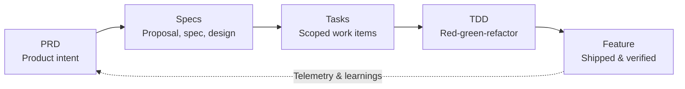

Most developers adopting AI coding assistants fall into a familiar loop: drop a loose feature description into a chat prompt, get back several hundred lines of reasonable-looking code, and spend the rest of the day patching broken imports, fixing edge cases, and untangling silent regressions.

The issue isn't that language models are bad at writing code. It is that jumping straight from an informal idea to implementation forces the model to invent everything in between: architectural boundaries, state management, error handling, and unstated assumptions.

Prompts alone cannot bridge that gap. When context is fuzzy, models fill the void by inventing plausible but untested assumptions. The solution isn't clever prompt engineering—it is applying a structured discipline: **Spec-Driven Development (SDD)**.

---

## The Spec-Driven Pipeline

Instead of relying on freeform chat threads to guide implementation, Spec-Driven Development establishes a structured, closed-loop pipeline from intent to production:



Each stage in this pipeline acts as an explicit contract for the next, reducing ambiguity before code is generated.

---

## 1. PRD: Human Intent

The **PRD** (Product Requirements Document) defines the human intent: what problem needs solving, who it affects, and how success will be measured.

It is written for humans rather than compilers. It focuses on business objectives and user constraints, remaining stable even when technical implementation details change.

```markdown
# PRD: Dark mode
**Problem:** Users working in low-light environments report eye fatigue and request a dark UI.
**Goal:** Allow users to toggle between light and dark themes.
**Success metric:** 20% of active users enable the dark theme within 30 days of release.
```

The PRD purposefully leaves out implementation details like CSS variables, state libraries, or schema changes. It defines the "why" and the boundaries of success.

---

## 2. Specs: The Architectural Contract

The **Specs** layer translates product intent into concrete behavioral specifications and technical design before anyone writes implementation code.

Using structured specification frameworks like [OpenSpec](https://openspec.dev/), engineers define the feature's behavior through verifiable scenarios:

```markdown
### Requirement: Theme toggle
The system SHALL let a user switch between light and dark themes from settings.

#### Scenario: User enables dark mode
- WHEN the user selects "Dark" in Settings > Appearance
- THEN the UI switches to the dark theme and persists the choice across sessions
```

Framing requirements as explicit scenarios (Given/When/Then or When/Then) makes expectations testable. It gives both human reviewers and AI agents a concrete target, catching scope creep and conflicting assumptions before code is written.

---

## 3. Tasks: Scoped Work Items

With the specification established, work decomposes into discrete, vertical-slice tasks that map directly to an issue tracker like Linear or GitHub Issues.

Because every task links directly to a spec requirement, scope stays bounded:

```markdown
## T1: Add dark mode toggle
**Spec ref:** theme-toggle
- [ ] Toggle appears in Settings > Appearance
- [ ] Selection persists across sessions
- [ ] Defaults to system preference if unset
```

Developers and agents work on well-defined increments rather than unbounded feature requests. This keeps PRs small, prevents scope creep, and clarifies what "done" means for each piece of work.

---

## 4. TDD: Executable Specs

With scoped tasks in hand, **Test-Driven Development (TDD)** serves as the execution engine:

1. **Red**: Write a failing test that encodes the behavioral requirement from the spec.
2. **Green**: Write the minimum code necessary to make the test pass.
3. **Refactor**: Clean up the architecture and eliminate duplication while keeping tests green.

```
   ┌─────────┐
   │   RED   │  Write failing test encoding spec requirement
   └────┬────┘
        │
        ▼
   ┌─────────┐
   │  GREEN  │  Write minimum code to pass
   └────┬────┘
        │
        ▼
   ┌─────────┐
   │REFACTOR │  Clean up architecture & remove duplication
   └─────────┘
```

In an AI-assisted workflow, TDD turns the spec into an automated feedback loop. When you give an AI agent a failing test alongside the spec requirement, the agent has a clear, objective verification harness. Instead of guessing whether its output meets requirements or relying on manual browser checks, the agent iterates against the test suite until it passes.

---

## 5. Features & Learnings: Closing the Loop

The final stage is delivering the verified feature to production.

Delivery does not end when code merges. Once deployed, the feature's real-world performance is measured against the success metrics originally set in the PRD (for example, whether 20% of active users actually adopted dark mode within 30 days). Production telemetry, error rates, and user feedback feed directly into future PRDs, closing the loop.

---

## Toward a Product Engineering System

Most teams using AI today operate ad hoc: copying snippets between chat windows, pasting error traces back and forth, and hoping the model maintains architectural consistency across a multi-day feature.

Teams shipping reliably with AI treat this as a systems problem. Environments like [Aliveness Dev](https://github.com/aliveness-dev) operationalize the full pipeline—guiding engineers and agents from intent capture and OpenSpec behavioral models to ticket decomposition and test-driven execution.

AI models are effective execution engines when given clear constraints. By anchoring development in explicit specifications and executable tests, teams spend less time prompt-wrangling and more time shipping durable software.
