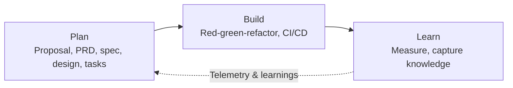
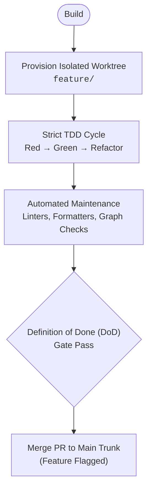
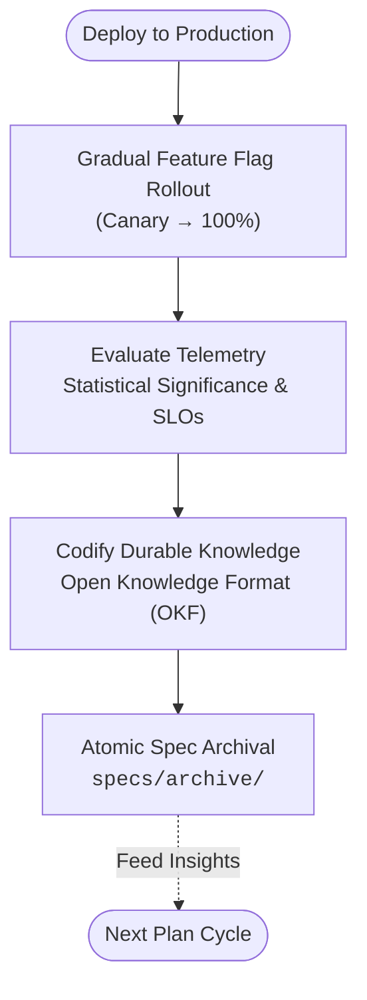

Most developers adopting AI coding assistants fall into a familiar loop: drop a loose feature description into a chat prompt, get back several hundred lines of reasonable-looking code, and spend the rest of the day patching broken imports, fixing edge cases, and untangling silent regressions.

The issue isn't that language models are bad at writing code. It is that jumping straight from an informal idea to implementation forces the model to invent everything in between: architectural boundaries, state management, error handling, and unstated assumptions.

Prompts alone cannot bridge that gap. When context is fuzzy, models fill the void by inventing plausible but untested assumptions. The solution isn't clever prompt engineering—it is applying a structured discipline: **Spec-Driven Development (SDD)** organized around a closed-loop **Plan → Build → Learn** lifecycle.

---

## The Spec-Driven Pipeline

Instead of relying on freeform chat threads to guide implementation, Spec-Driven Development establishes a structured, closed-loop pipeline from intent to production:



Each stage in this pipeline acts as an explicit contract for the next, bound by deterministic quality gates that prevent drift before code is generated or merged.

---

## 1. Plan: From Intent to Ready Tasks

The **Plan** stage turns ambiguous feature ideas into unambiguous, testable engineering contracts. Rather than jumping straight to generation, planning systematically moves through four phases:


### Capturing Intent & Boundaries (Proposal / PRD)

Before designing APIs or database tables, we define the human intent: what problem needs solving, who it affects, what constraints apply, and how success will be measured.

```markdown
# Proposal: Dark Mode
**Problem:** Users working in low-light environments report eye strain and request a dark UI.
**Desired Outcome:** Allow users to toggle between light and dark themes from settings.
**Success Metric:** 20% of active users enable the dark theme within 30 days of release.
```

The proposal purposefully omits implementation mechanics like CSS variables, state libraries, or schema migrations. It establishes the "why" and sets non-goals to prevent scope creep.

### Behavioral Specifications & Architecture (`spec.md` & `design.md`)

The specification layer translates product intent into concrete behavioral contracts and technical architecture before touching implementation code.

Using structured specification formats like [OpenSpec](https://openspec.dev/), requirements are defined through verifiable Given/When/Then scenarios using RFC 2119 keywords:

```markdown
### Requirement: Theme Toggle
The system SHALL let an authenticated user switch between light and dark themes from account settings.

#### Scenario: User enables dark mode
- GIVEN a user on the account appearance settings page
- WHEN the user selects "Dark"
- THEN the UI immediately switches theme without page reload
- AND the preference persists across subsequent browser sessions
```

Alongside the behavioral contract, `design.md` specifies technical boundaries: component boundaries, state management models, storage schemas, and security invariants.

Modern spec pipelines also practice **progressive rigor**:
- **Micro Tier (`tier: micro`)**: For lightweight brownfield changes or single-component updates, requirements and tasks consolidate into a single, concise `spec.md`.
- **Standard / Major Tiers (`tier: standard` / `tier: major`)**: For cross-component or architectural features, full artifact separation (`proposal.md`, `spec.md`, `design.md`, `tasks.md`) and formal Decision Records are enforced.

### Vertical Task Decomposition (`tasks.md`)

Once the specification passes validation, the work decomposes into discrete, dependency-ordered tasks structured as a Directed Acyclic Graph (DAG):

```markdown
## Task T1: Theme persistence API and store
- [ ] Create user preference schema migration
- [ ] Implement theme toggle endpoint with session validation
- blocked_by: []

## Task T2: Settings UI toggle component
- [ ] Add dark mode toggle to Settings > Appearance
- [ ] Wire toggle to persistence API
- blocked_by: [T1]
```

Every task slices vertically across the necessary layers (interface, domain, data) rather than horizontally (no "DB-only" or "styling-only" PRs). Tasks explicitly declare dependencies (`blocked_by`), preventing out-of-order execution churn.

### The Review Breakpoint: Definition of Ready (DoR)

The planning stage stops deterministically at the **Definition of Ready (DoR)** gate. DoR audits that:
1. Intent, constraints, and success metrics are explicitly defined.
2. Requirements are captured as verifiable Given/When/Then scenarios.
3. Architecture, data contracts, and failure modes are addressed.
4. Tasks are cleanly sliced with verified dependencies.

By halting at DoR, planning establishes an intentional human-in-the-loop review seam. Worktrees are not dirtied, branches are not provisioned, and agents do not start coding until the team aligns on the contract.

---

## 2. Build: Test-Driven Implementation & Trunk Safety

Once a change satisfies DoR, execution transitions to the **Build** stage. Here, specifications become executable verification harnesses.



### Isolated Workspaces & Topological Execution

Executing tasks directly in a shared working copy invites git conflicts, untracked artifacts, and context pollution. The build workflow automatically checks out an isolated Git worktree per task.

Furthermore, execution enforces topological dependencies: if a developer or agent attempts to execute `T2` while `T1` is still pending, the execution engine blocks the task and redirects attention to the unblocked dependency.

### Executable Specs via Strict TDD

With an isolated workspace and scoped task in hand, **Test-Driven Development (TDD)** serves as the execution engine:

```
   ┌─────────┐
   │   RED   │  Write failing test encoding the spec scenario
   └────┬────┘
        │
        ▼
   ┌─────────┐
   │  GREEN  │  Write minimum production code to pass
   └────┬────┘
        │
        ▼
   ┌─────────┐
   │REFACTOR │  Clean up architecture, lint, & remove duplication
   └─────────┘
```

In an AI-assisted workflow, TDD is the antidote to model hallucination:
- **Objective harness**: When you hand an agent a failing test alongside a Given/When/Then scenario, the model doesn't need to guess whether its implementation works. It has an objective test harness to run against.
- **Fast feedback loop**: The agent iterates in red-green cycles, executing local test runners until assertions pass.
- **Scope containment**: Because tests enforce exact spec scenarios, the model cannot arbitrarily invent unrelated features or refactor untouched subsystems.

### Automated Hygiene & Definition of Done (DoD)

Before an implementation slice can be submitted or merged, it must clear the **Definition of Done (DoD)** gate:
- All unit, integration, and contract tests pass.
- Repository maintenance tasks (`make maintain`, linters, code formatters, documentation link validators) execute cleanly.
- Unfinished or high-impact features are wrapped safely behind dark feature flags (`default: false`).

Each completed task yields a small, focused Pull Request merged continuously into trunk.

---

## 3. Learn: Telemetry, Knowledge Codification & Archival

Shipping code to production is not the end of the lifecycle. The **Learn** stage closes the loop between deployed software and future planning.



### Evaluating Telemetry Against Hypotheses

Once deployed, the feature's real-world impact is evaluated against the hypotheses and metrics originally stated in the proposal:
- Did 20% of active users adopt dark mode within 30 days?
- Did latency or error budgets regress?
- Are the observed metric deltas statistically significant?

Modern tooling evaluates runtime telemetry (e.g., PostHog events, error tracking) with sequential statistical significance checks, avoiding premature conclusions or confirmation bias. If a feature fails to move the intended needle or triggers user friction, feature flags allow instant rollback.

### Codifying Durable Knowledge (OKF)

Engineering teams suffer from amnesia. Critical lessons learned during implementation—edge-case browser behaviors, state synchronization quirks, operational invariants—frequently get buried in merged PR comments or ephemeral AI chat histories.

In the Learn stage, hard-won insights are promoted into durable documentation using standardized knowledge schemas like the **Open Knowledge Format (OKF)** in `docs/concepts/`:

```markdown
---
id: "concept:theme-persistence-invariants"
title: "Theme Preference Storage & SSR Flash Invariants"
status: "verified"
sources:
  - "specs/changes/2026-09-22-dark-mode/spec.md"
---

# Theme Preference Storage Invariants
Client-side theme preferences must be synchronized with root HTML classes prior to first paint to avoid theme flash (FOUC).
```

By curating durable domain models and architectural decisions, future agent sessions and engineers can instantly ground themselves in established system invariants.

### Atomic Archival & Closing the Loop

Finally, the completed change directory is atomically archived from `specs/changes/` to `specs/archive/`, marking all tasks completed and recording lifecycle timestamps.

The telemetry, user feedback, and architectural insights captured during the Learn stage directly seed the next **Plan** cycle, completing the feedback loop.

---

## Toward a Product Engineering System

Most teams adopting AI today operate ad hoc: pasting snippets into chat windows, arguing with models over broken imports, and hoping the assistant remembers yesterday's architectural decisions.

Teams shipping reliably treat this as a systems problem. Environments like [Aliveness Dev](https://github.com/aliveness-dev) operationalize the full **Plan → Build → Learn** pipeline:
- Guiding founders, PMs, and engineers through structured intent capture and OpenSpec behavioral modeling.
- Enforcing deterministic quality gates (DoR and DoD) and isolated Git worktree execution.
- Driving test-driven execution and continuous trunk integration.
- Evaluating production telemetry and codifying institutional knowledge.

AI models are extraordinary execution engines when given clear constraints and verifiable contracts. By anchoring development in a disciplined Plan-Build-Learn lifecycle, teams spend less time wrangling prompts and more time delivering durable, verified software.
