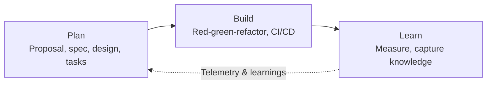
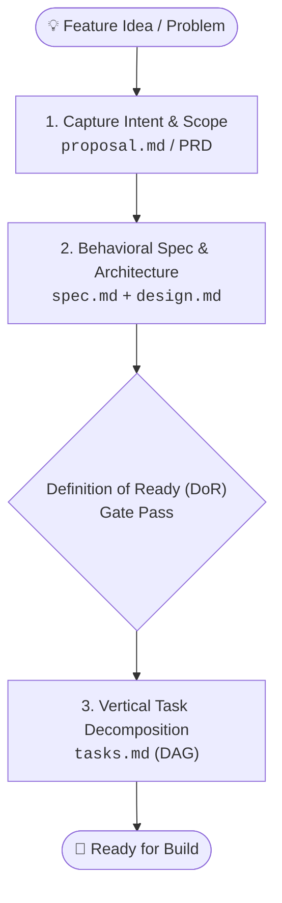
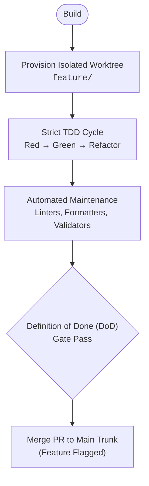

If you use AI coding assistants, you know the cycle: paste a rough feature description into a chat box, get back three hundred lines of plausible code, and spend the rest of your day hunting down broken imports, missed edge cases, and silent regressions.

The model isn't necessarily bad at writing syntax. The problem is asking it to jump straight from a vague idea to implementation. Without clear boundaries, the model has to invent everything in between—state management, error handling, data flow, and all your unstated constraints.

Better prompt engineering won't solve this. When context is fuzzy, models hallucinate plausible defaults. To get reliable software out of an AI, you need a product-engineering-qa harness: **Spec-Driven Development (SDD)** organized around a tight **Plan → Build → Learn** cycle.

---

## The Spec-Driven Workflow

Instead of running off ad-hoc chat threads, Spec-Driven Development breaks delivery into three stages:



Each stage produces a clear contract for the next, separated by gates that catch misunderstandings before code gets written or merged into your codebase.

---

## 1. Plan: From Intent to Ready Tasks

The **Plan** stage turns vague ideas into testable contracts. Before generating code, planning steps through four distinct checkpoints:



### Clarify Intent & Scope (Proposal / PRD)

Before touching APIs or database schemas, write down what you actually want to achieve: the problem, who it affects, constraints, and how you will measure success.

```markdown
# Proposal: Dark Mode
**Problem:** Users working in low-light environments report eye strain and request a dark UI.
**Desired Outcome:** Allow users to toggle between light and dark themes from settings.
**Success Metric:** 20% of active users enable the dark theme within 30 days of release.
```

Keep implementation details out of this document. No CSS variables, state managers, or schema migrations yet. You want clear agreement on the "why" and explicit non-goals to keep scope tight.

### Behavioral Specs & Architecture (`spec.md` & `design.md`)

Next, turn product intent into behavioral contracts and system architecture.

Using structured formats like [OpenSpec](https://openspec.dev/), define requirements with verifiable Given/When/Then scenarios and RFC 2119 keywords:

```markdown
### Requirement: Theme Toggle
The system SHALL let an authenticated user switch between light and dark themes from account settings.

#### Scenario: User enables dark mode
- GIVEN a user on the account appearance settings page
- WHEN the user selects "Dark"
- THEN the UI immediately switches theme without page reload
- AND the preference persists across subsequent browser sessions
```

Alongside the behavior, use `design.md` to map out technical boundaries: component boundaries, state flow, database schemas, and security constraints.

Match ceremony to the risk (**progressive rigor**):
- **Micro Tier (`tier: micro`)**: For bug fixes or simple UI tweaks, collapse requirements and tasks into a single `spec.md`.
- **Standard & Major Tiers (`tier: standard` / `tier: major`)**: For multi-system changes or architectural updates, keep artifacts separate (`proposal.md`, `spec.md`, `design.md`, `tasks.md`) and document key choices in Decision Records.

### Slicing Vertical Tasks (`tasks.md`)

Once the specification is solid, break the work down into a dependency-ordered list of tasks (a DAG):

```markdown
## Task T1: Theme persistence API and store
- [ ] Create user preference schema migration
- [ ] Implement theme toggle endpoint with session validation
- blocked_by: []

## Task T2: Settings UI toggle component
- [ ] Add dark mode toggle to Settings > Appearance
- [ ] Wire toggle to persistence API
- blocked_by: [T1]
```

Slice tasks vertically through UI, business logic, and storage—avoid horizontal "DB-only" or "styling-only" PRs. Declaring explicit dependencies (`blocked_by`) stops an AI from jumping ahead before the groundwork exists.

### Definition of Ready (DoR)

Planning stops cold at the **Definition of Ready (DoR)** gate. Before opening an editor or kicking off a prompt:
1. The problem, boundaries, and success metrics are written down.
2. Requirements are captured as verifiable scenarios.
3. Architecture, data models, and failure modes are resolved.
4. Tasks are sliced with explicit dependencies.

This pause is intentional. You don't create branches, dirty git trees, or burn tokens on code until everyone agrees on what "done" looks like.

---

## 2. Build: Test-Driven Implementation & Trunk Safety

Once a change clears DoR, execution moves to **Build**. Here, specifications become executable test suites.



### Isolated Worktrees & Topological Ordering

Letting an AI write code directly in your active working branch is a quick way to accumulate git noise and untracked files. Check out an isolated Git worktree for each task (`feature/<slug>`).

Respect task dependencies. If `T2` depends on `T1`, don't attempt `T2` until `T1` is merged and verified. Keeping the order strict keeps context clean.

### Why TDD Matters Even More with AI

With an isolated worktree and a clear task, **Test-Driven Development (TDD)** becomes your safety harness:

```
   ┌─────────┐
   │   RED   │  Write failing test encoding the spec scenario
   └────┬────┘
        │
        ▼
   ┌─────────┐
   │  GREEN  │  Write minimum production code to pass
   └────┬────┘
        │
        ▼
   ┌─────────┐
   │REFACTOR │  Clean up architecture, lint, & remove duplication
   └─────────┘
```

When you tell an LLM "build feature X," it gives you code that compiles and looks right at a glance. But when you hand it a failing test based on a Given/When/Then scenario:
- **No guessing**: The model doesn't need to estimate whether its code works. It runs the test suite. Green means pass; red means try again.
- **Fast feedback**: The agent iterates in red-green cycles, fixing bugs against real compiler errors and test assertions.
- **Contained scope**: Because the tests verify exact requirements, the model is much less likely to wander off and rewrite untouched subsystems.

### Definition of Done (DoD)

Before opening a PR or merging into trunk, the branch must pass the **Definition of Done (DoD)**:
- All unit, integration, and contract tests pass without skips.
- Repository checks (`make maintain`, linters, formatters, and link checkers) run clean.
- In-progress or risky features are tucked behind feature flags (`default: false`).

Keep PRs small. Land each completed task directly into trunk behind a flag instead of letting massive feature branches drift for weeks.

---

## 3. Learn: Telemetry, Knowledge & Archival

Deploying code isn't where things end. The **Learn** stage connects real-world production results back to your next round of planning.


### Measure Against the Original Hypothesis

Once code is in production and rolls out behind a flag, check whether it actually delivered on the proposal:
- Did users adopt dark mode as expected?
- Did p99 latency or error rates budge?
- Are the metric changes real, or just noise?

If numbers tank or errors spike, turn the flag off. When you measure early, you don't have to guess whether a feature worked.

### Save What You Learned (OKF)

Every non-trivial build exposes subtle surprises: browser-specific layout glitches, auth token edge cases, or caching caveats.
Usually, those discoveries get buried in squashed PR comments or lost in transient chat logs.
Before moving to the next feature, document those system invariants—for example, using an Open Knowledge Format (OKF) file in `docs/concepts/`:

```markdown
---
id: "concept:theme-persistence-invariants"
title: "Theme Preference Storage & SSR Flash Invariants"
status: "verified"
sources:
  - "specs/changes/2026-09-22-dark-mode/spec.md"
---

# Theme Preference Storage Invariants
Client-side theme preferences must be synchronized with root HTML classes prior to first paint to avoid theme flash (FOUC).
```

Writing down invariants gives both teammates and future AI runs immediate context, preventing them from making the same mistakes twice.

### Archive and Feed the Next Cycle

Finally, move completed change specs from `specs/changes/` into `specs/archive/`, marking tasks finished and capturing timestamps.

What you learn from metrics, bugs, and user feedback feeds directly into your next **Plan** stage, closing the loop.

---

## Building a System, Not Chasing Prompts

Most teams adopting AI code ad hoc: pasting snippets into chat prompts, fighting with models over hallucinated imports, and hoping the bot remembers yesterday's architectural decisions.

Teams shipping reliably treat this as a workflow problem. Tooling like [Aliveness Dev](https://github.com/aliveness-dev) operationalizes this **Plan → Build → Learn** pipeline:
- Walking through intent capture and spec-driven behavioral models.
- Enforcing quality gates (DoR and DoD) and isolated worktrees.
- Driving strict test-driven development into main trunk.
- Tracking production telemetry and recording durable knowledge.

Language models make great execution engines when they have strict constraints and clear contracts. Ground them in a solid Plan-Build-Learn loop, and you can stop wrangling prompts and get back to shipping reliable software.
