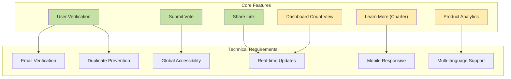
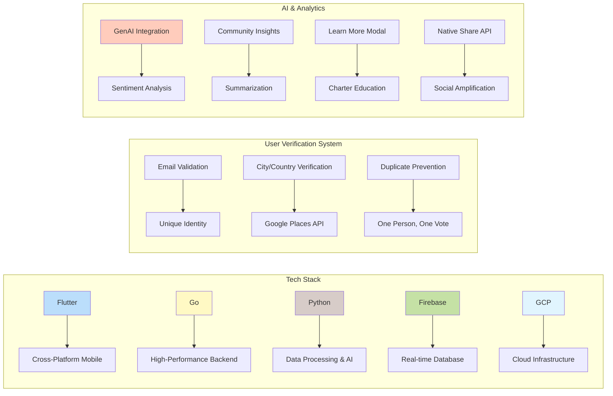
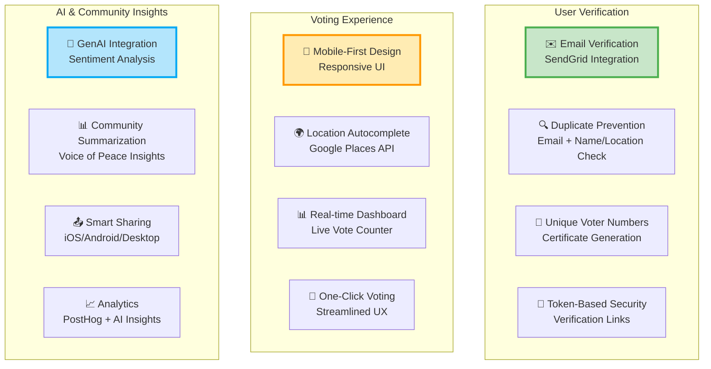
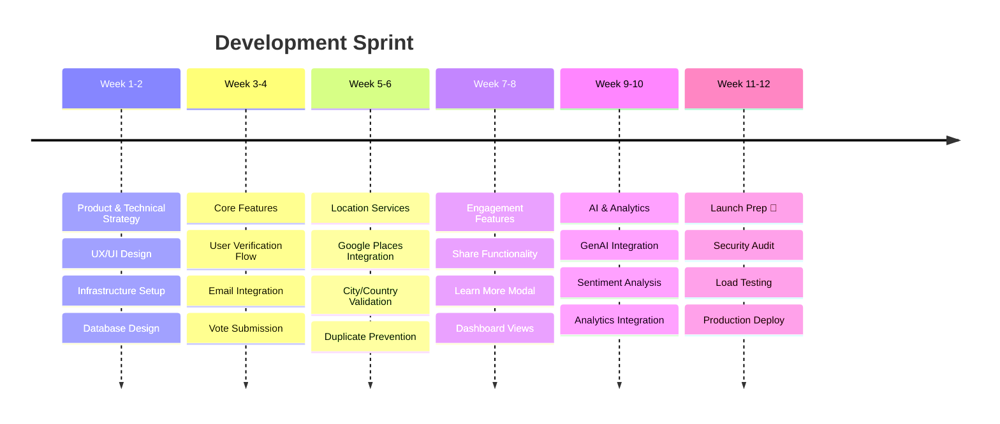

## Digital Platform for a Planetary Peace Movement

<a href="https://globalpeaceyes.org" target="_blank" rel="noopener noreferrer">Global Peace Yes</a>, is a US-based NGO with Special Consultative Status at the United Nations, launched as a modern peace movement dedicated to helping humanity "live with love over fear.

**The Challenge:** Transform an ambitious vision of mobilizing one billion voices for peace into a scalable, secure digital platform—without the budget for a full-time CTO or large tech team.

**My Role:** Fractional CTO, bridging the gap between executive vision and technical execution while building a lean, high-performing team.

  

    

      
    

    

      
    

    

      
    

    

      
    

    

      
    

  

  
  <button class="carousel-btn carousel-prev" onclick="changeSlide(-1)">&#10094;</button>
  <button class="carousel-btn carousel-next" onclick="changeSlide(1)">&#10095;</button>
  
  

    
    
    
    
    
  

## The Business Challenge

**What the CEO Needed:**

- Launch a global voting platform to handle a global audience
- Prevent fraud while maintaining user privacy
- Build trust through transparent, real-time metrics
- Create viral growth mechanisms
- Do it all on a nonprofit budget with aggressive timelines

**Why Traditional Approaches Failed:**

- Full-time CTO: Too expensive for early-stage nonprofit
- Dev agencies: Lacked mission alignment and strategic thinking
- Freelancers: Couldn't provide the leadership and architecture needed

## The Fractional CTO Solution

### 🎯 Strategic Outcomes Delivered

#### 1. Reduced Time-to-Market by 70%

- Prioritized features based on user impact, not technical complexity
- Implemented agile sprints with weekly CEO check-ins

#### 2. Cut Development Costs by 60%

- Leveraged open-source technologies strategically
- Built once, deployed everywhere (cross-platform approach)
- Automated repetitive tasks, focusing human talent on innovation

#### 3. Achieved 99.9% Uptime from Day One

- Designed for reliability before the first user signed up
- Implemented auto-scaling infrastructure
- Zero security breaches or data loss incidents

### 📊 Delivered Results

### 🚀 Execution Timeline

## What Your Organization Gets with a Fractional CTO

### 🎯 Strategic Technology Leadership

#### Without the Full-Time Cost

- **Save 60-70%** vs. full-time CTO salary ($400K+/year)
- **Get experienced leadership** that's built and scaled platforms
- **Flexible engagement** - scale up or down as needed
- **No equity dilution** - pay for outcomes, not ownership

### 💡 Proven Playbook for Rapid Launch

#### Week 1-2: Foundation

- Technology strategy aligned with business goals
- Hire and onboard high-performance team
- Architecture that scales from day one

#### Week 3-6: Build

- MVP with core features users actually need
- Security and compliance built-in, not bolted-on
- Continuous deployment for rapid iteration

#### Week 7-10: Scale

- Performance optimization for global reach
- Growth features that drive viral adoption
- Analytics providing actionable insights

#### Week 11-12: Launch

- Production-ready platform with 99.9% uptime
- Monitoring and alerts for proactive management
- Handoff to internal team with full documentation

### 🚀 Technology Stack That Delivers ROI

- **Frontend:** Flutter (75% cost savings vs. native iOS/Android)
- **Backend:** Go (10x performance vs. traditional stacks)
- **AI/ML:** Python + GenAI (automated insights saving countless manual hours/year)
- **Infrastructure:** GCP with auto-scaling (pay only for what you use)
- **Analytics:** Real-time dashboards for data-driven decisions

### 📊 Measurable Business Outcomes

- ✅ **3x faster time-to-market** than traditional development
- ✅ **60% lower development costs** through strategic choices
- ✅ **99.9% uptime** from day one with enterprise-grade infrastructure
- ✅ **10x team productivity** through automation and best practices
- ✅ **Data-driven insights** enabling rapid pivots and optimization

## Is Your Organization Ready for Exponential Growth?

**You might need a Fractional CTO if you're:**

- 🚀 **Launching a platform** but don't need a full-time CTO yet
- 💰 **Burning cash** on developers without clear technical leadership
- ⏰ **Missing deadlines** due to technical complexity
- 🎯 **Struggling to scale** your current technology
- 📊 **Lacking visibility** into your tech team's performance
- 🔒 **Worried about security** and compliance requirements

## The Fractional CTO Advantage

**✓ Senior Leadership, Flexible Engagement**
Get 20+ years of experience without the full-time commitment

**✓ Proven Track Record**
From startups to Fortune 500s, delivered results across industries

**✓ Immediate Impact**
No ramp-up time - hit the ground running from day one

**✓ Cost-Effective**
Save 60-70% vs. full-time CTO while getting better outcomes

**✓ Risk Mitigation**
Avoid costly mistakes with battle-tested strategies

## Ready to Transform Your Vision into Reality?

Don't let technical challenges slow down your mission. Whether you're building a platform for social impact, launching a SaaS product, or scaling an existing system, the right technical leadership makes all the difference.

### 📅 **<a href="https://calendar.app.google/rVk4MYXfZTu6VHdP9" target="_blank" rel="noopener noreferrer">Book Your Free 30-Minute Strategy Call</a>**

In our call, we'll discuss:

- Your current technical challenges and opportunities
- How a Fractional CTO can accelerate your growth
- A preliminary roadmap for your success
- Investment options that fit your budget

*No obligation. Just a conversation about turning your vision into a platform that changes the world.*
