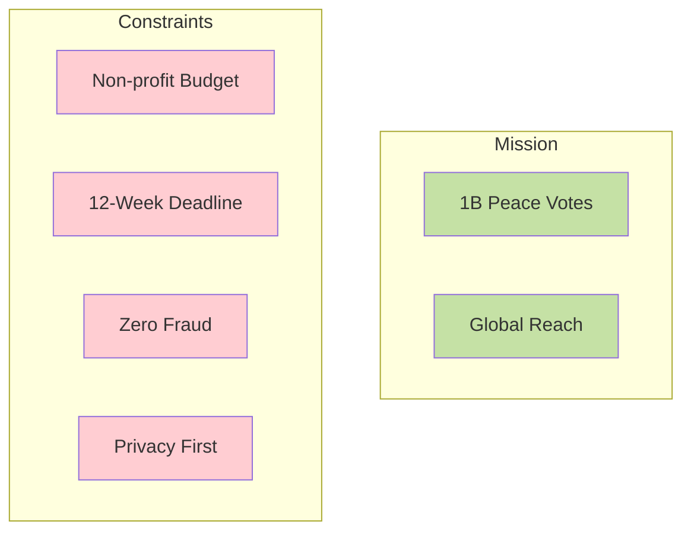
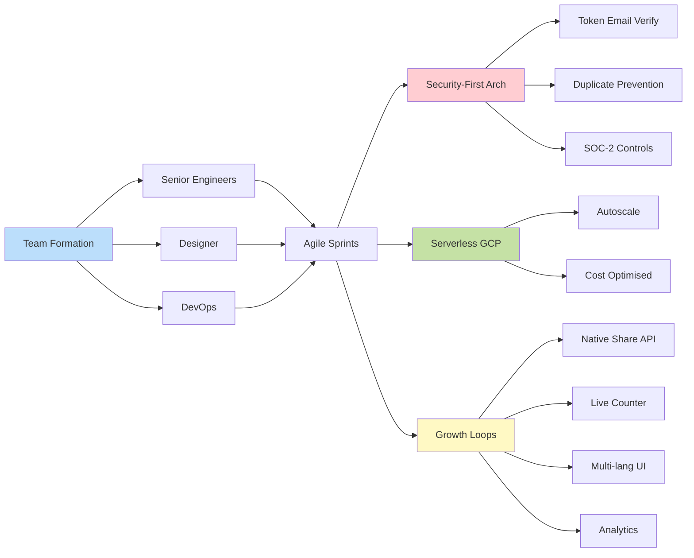
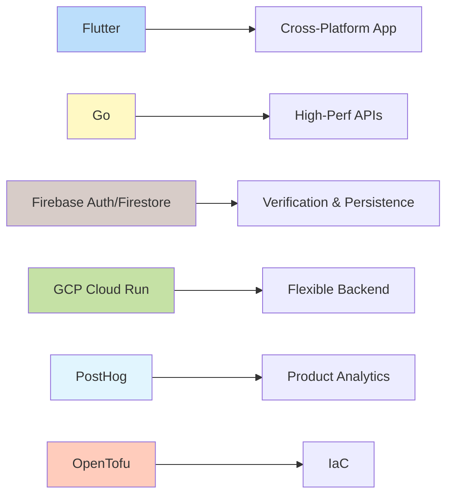

## Digital Platform for a Planetary Peace Movement

<a href="https://globalpeaceyes.org" target="_blank" rel="noopener noreferrer">Global Peace Yes</a> is a U.S-based NGO (Special Consultative Status at the U.N.) rallying one billion voices to "live with love over fear." As **Fractional CTO** I turned a bold vision into an operational, fraud-resistant voting platform.

  

    

      
    

    

      
    

    

      
    

    

      
    

    

      
    

  

  
  <button class="carousel-btn carousel-prev" onclick="changeSlide(-1)">&#10094;</button>
  <button class="carousel-btn carousel-next" onclick="changeSlide(1)">&#10095;</button>
  
  

    
    
    
    
    
  

---

## Challenge

Mobilise **one billion verified votes** for peace while protecting privacy, blocking fraud and earning public trust, on a nonprofit budget and an aggressive deadline.

## Approach

I contributed as Fractional CTO:

1. **Lean team** – collaborated with engineers, designers and DevOps.
2. **Security-first architecture** – tokenised email verification, duplicate prevention and SOC-2-aligned infra.
3. **Serverless & open-source** – Firebase + GCP reduce cost, autoscale to any spike, and cut opex to zero.
4. **Growth loops built-in** – AI summarization, native share API, live counter, multi-language UI and analytics for rapid optimisation.

## Outcomes

- ✅ **MVP** live with 99.9% uptime.
- ✅ **Higher quality** and **100% mission-aligned** compared to dev agencies.
- ✅ **AI-powered**; summarization and community sentiment analysis.

## Stack

## Ready to spark your movement?

A Fractional CTO delivers enterprise-grade execution without the payroll burden or equity dilution.

🗓️ **<a href="https://calendar.app.google/rVk4MYXfZTu6VHdP9" target="_blank" rel="noopener noreferrer">Book a free 30-min strategy call</a>** and turn purpose into product, fast.
