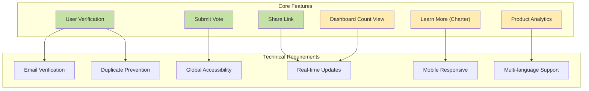
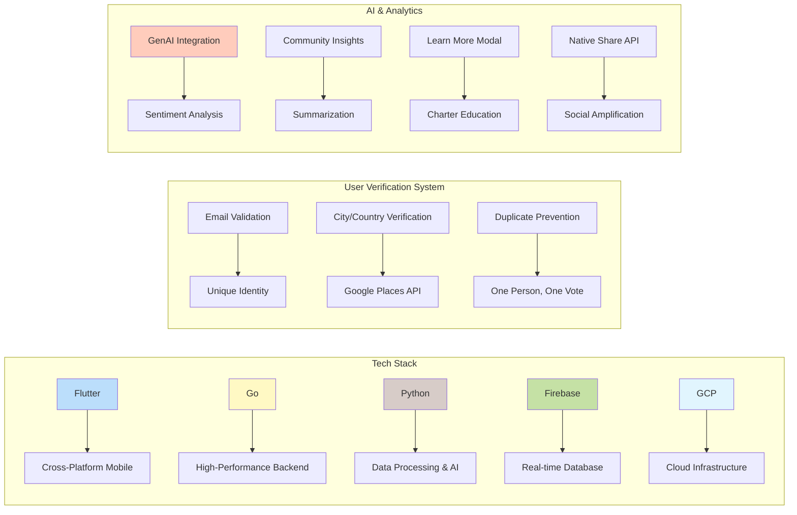
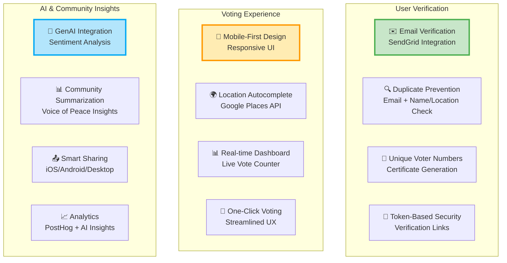
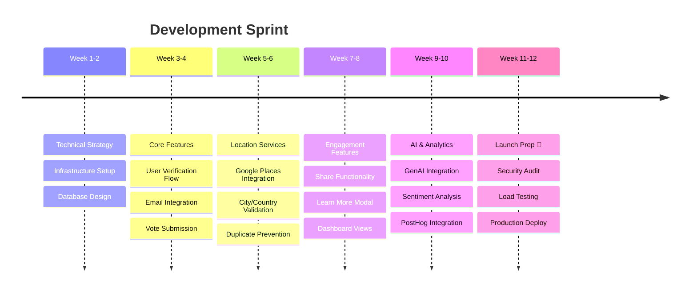

## Digital Platform for a Planetary Peace Movement

**<a href="https://globalpeaceyes.org" target="_blank" rel="noopener noreferrer">Global Peace Yes</a>** is a US-based NGO with Special Consultative Status at the United Nations, launched as a modern peace movement dedicated to helping humanity "live with love over fear." As **Fractional CTO**, I collaborated on technical strategy and execution, coordinating between the executive and tech team, managing the project, overseeing the development process, creating proof of concepts, research, setting up infrastructure, and supporting team members.

  

    

      
    

    

      
    

    

      
    

    

      
    

    

      
    

  

  
  <button class="carousel-btn carousel-prev" onclick="changeSlide(-1)">&#10094;</button>
  <button class="carousel-btn carousel-next" onclick="changeSlide(1)">&#10095;</button>
  
  

    
    
    
    
    
  

## The Challenge

Enable an accessible and engaging way for a global community to vote yes for global peace.

## My Impact as Fractional CTO

### 🏗️ Built the Foundation

### 📊 Delivered Results

### 🚀 Execution Timeline

## Key Deliverables

### User Verification System

- Implemented email-based verification with SendGrid integration
- Built duplicate prevention using email and name/location matching
- Created secure token-based verification flow
- Designed certificate generation with unique voter numbers

### Voting Platform

- Developed mobile-first responsive interface
- Integrated Google Places API for city/country selection
- Built real-time vote counting dashboard
- Implemented one-click voting experience

### Engagement Features

- Native share functionality for iOS/Android using Web Share API
- Desktop sharing with clipboard integration
- Educational "Learn More" modal for charter information
- PostHog analytics for tracking user engagement

### AI & Community Intelligence

- Implemented GenAI for sentiment analysis of community feedback
- Built summarization engine to extract key themes from voter messages
- Created insights dashboard showing community sentiment trends
- Automated report generation for peace movement patterns

### Technical Infrastructure

- Set up scalable Go backend for high-performance API
- Configured Firebase for real-time data synchronization
- Implemented Python services for data processing and AI/ML pipelines
- Deployed on Google Cloud Platform with auto-scaling

## The Outcome

> "By creating an accessible and engaging platform for global peace voting, we've enabled the ability for millions to make their voice heard in a movement that transcends borders and brings humanity together."

### By the Numbers

- ✅ **Secure verification** system preventing duplicate votes
- ✅ **Mobile-first** design reaching users globally
- ✅ **Real-time** dashboard showing collective impact
- ✅ **AI-powered insights** analyzing community sentiment
- ✅ **Seamless sharing** amplifying the movement
- ✅ **Analytics-driven** insights for continuous improvement

## Why This Matters for Your Mission-Driven Organization

A Fractional CTO brings technical expertise to social impact initiatives. If you need to:

- Build a **secure voting platform** for your cause
- Create **engaging digital experiences** for your community
- Implement **verification systems** at scale
- Launch a **global movement** with limited resources

Let's explore how I can help amplify your impact.

🧩 **<a href="https://calendar.app.google/rVk4MYXfZTu6VHdP9" target="_blank" rel="noopener noreferrer">Book a complementary 30-minute call</a>** to explore how technical leadership can accelerate your mission.
