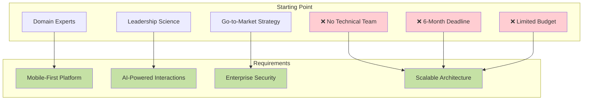
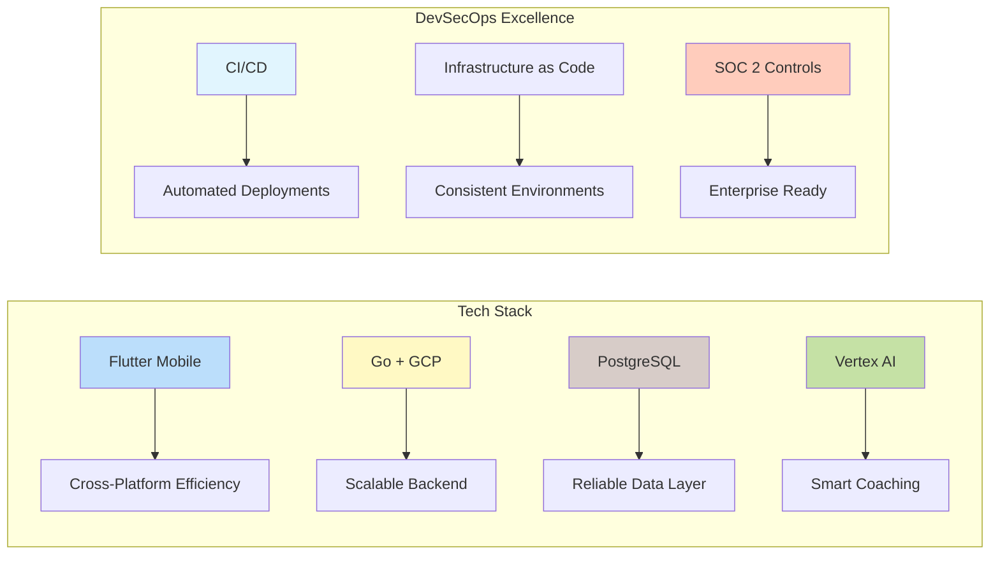
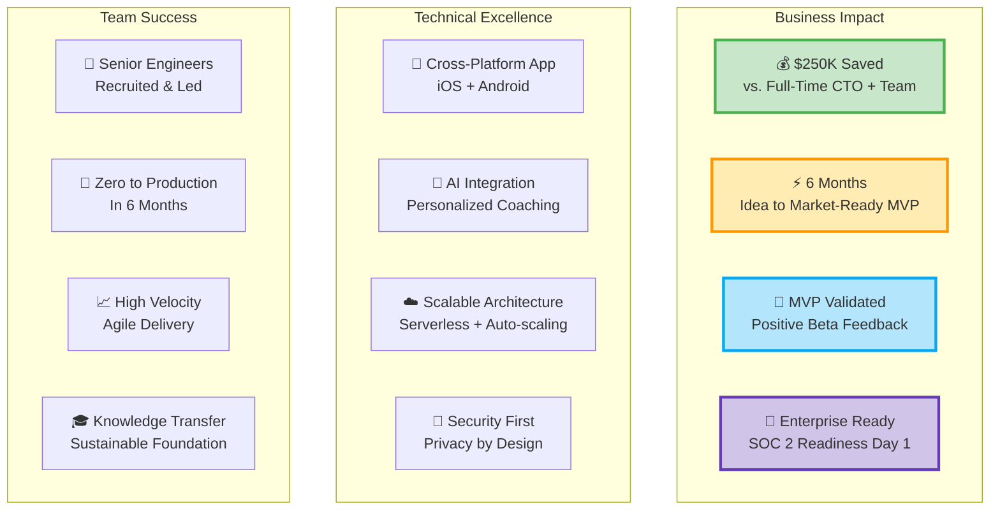
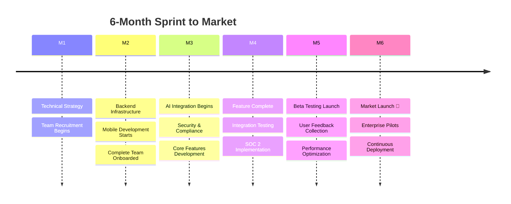

## AI-Powered Leadership Coaching Platform

**<a href="https://joyo.chat" target="_blank" rel="noopener noreferrer">JOYO</a>** delivers personalized leadership development through AI-powered coaching, trusted by institutions like **MIT**. As **Fractional CTO** for **<a href="https://aliveness.ventures" target="_blank" rel="noopener noreferrer">Aliveness Ventures</a>**, I helped transform a vision into a market-ready product in just 6 months.

  

    

      
    

    

      
    

    

      
    

    

      
    

    

      
    

    

      
    

    

      
    

  

  
  <button class="carousel-btn carousel-prev" onclick="changeSlide(-1)">&#10094;</button>
  <button class="carousel-btn carousel-next" onclick="changeSlide(1)">&#10095;</button>
  
  

    
    
    
    
    
    
    
  

## The Challenge

Starting with zero technical resources, JOYO needed to validate an AI-powered coaching platform in a competitive market—fast.

## My Impact as Fractional CTO

### 🏗️ Built the Foundation

### 📊 Delivered Results

### 🚀 Execution Timeline

## Key Deliverables

### Product & Technical Leadership
- Translated leadership science into actionable technical roadmap
- Defined metrics for activation, retention, and coaching quality
- Aligned engineering milestones with business objectives

### AI-Powered Features
- Contextual micro-coaching with Vertex AI
- Sentiment analysis and engagement tracking
- Personalized nudges based on user behavior
- Privacy-first architecture maintaining user trust

### Team & Process
- Recruited and led distributed team of senior engineers
- Implemented lightweight Agile process for rapid iteration
- Nurtured culture of psychological safety and continuous improvement

## The Outcome

> "In just half a year, we went from a slide-deck to a validated MVP with engaged users. Having a Fractional CTO who could both lead strategic thinking and technical execution was a game-changer."

### By the Numbers:
- ✅ **6 months** from concept to market-ready MVP
- ✅ **$250,000** saved vs. full-time CTO + team
- ✅ **SOC 2 ready** from day one
- ✅ **Enterprise pilots** secured
- ✅ **Positive user feedback** from beta testing

## Why This Matters for Your Startup

A Fractional CTO brings enterprise-level expertise without the full-time cost. If you need to:

- Ship a market-ready MVP **fast**
- Build AI features **responsibly**
- Scale your tech team **efficiently**
- Prepare for enterprise deals **early**

Let's explore how I can accelerate your growth.

🧩 **<a href="https://calendar.app.google/rVk4MYXfZTu6VHdP9" target="_blank" rel="noopener noreferrer">Book a complementary 30-minute call</a>** to explore whether Fractional CTO support is the missing piece your startup needs.
