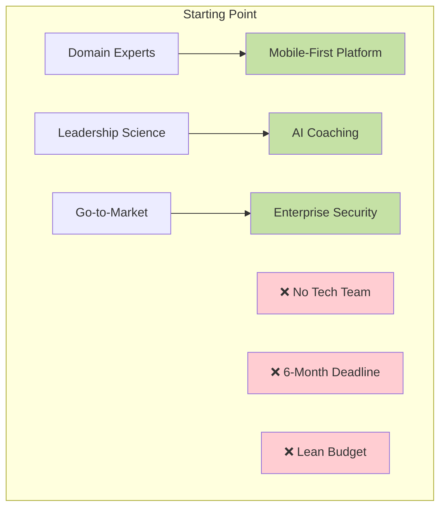
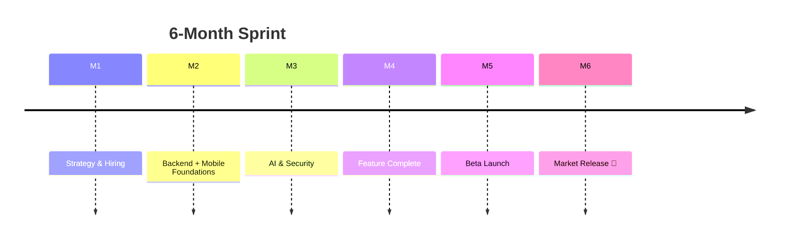
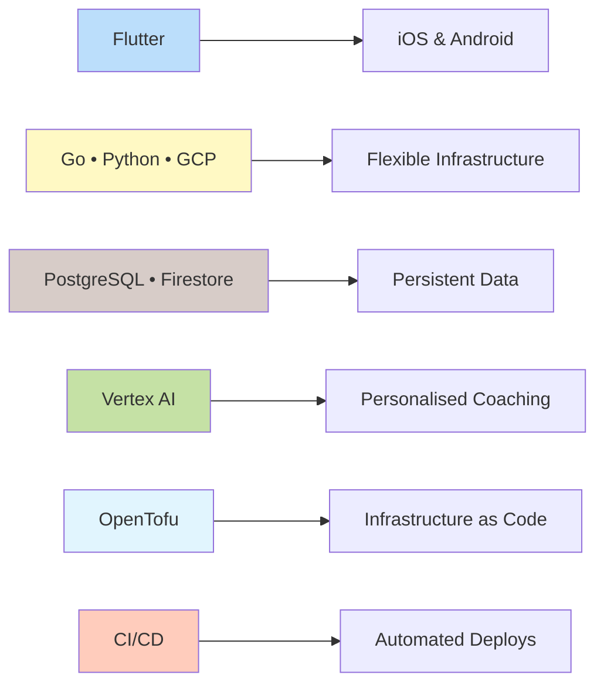

## AI-powered leadership coaching platform

**<a href="https://joyo.chat" target="_blank" rel="noopener noreferrer">JOYO</a>** delivers personalised leadership development through AI-powered coaching, trusted by institutions like **MIT**. As **Fractional CTO** for **<a href="https://aliveness.ventures" target="_blank" rel="noopener noreferrer">Aliveness Ventures</a>**, I helped turn a slide-deck vision into a market-ready product in six months.

  

    

      
    

    

      
    

    

      
    

    

      
    

    

      
    

    

      
    

    

      
    

  

  
  <button class="carousel-btn carousel-prev" onclick="changeSlide(-1)">&#10094;</button>
  <button class="carousel-btn carousel-next" onclick="changeSlide(1)">&#10095;</button>
  
  

    
    
    
    
    
    
    
  

---

## Challenge

Starting with zero technical resources, JOYO needed to validate an AI-powered coaching platform in a competitive market—fast.

## Approach

I stepped in as Fractional CTO to architect, hire and ship simultaneously:

1. **Team** – recruited senior engineers in 3 weeks.
2. **Architecture** – serverless, SOC 2-ready from day one.
3. **AI** – integrated Vertex AI for contextual micro-coaching.
4. **Process** – lightweight Agile with weekly demos and automated CI/CD.

## Outcome

- ✅ **6 months** from idea to public release.
- ✅ **$250k** saved versus in-house CTO & team.
- ✅ **SOC 2 controls** implemented day one; enterprise pilots secured.
- ✅ **>85%** positive feedback from beta users on coaching relevance.

## Stack

## Ready to accelerate?

A Fractional CTO gives you enterprise-level strategy and execution without the overhead. Ship faster, build responsibly, and engage your customers.

🗺️ **<a href="https://calendar.app.google/rVk4MYXfZTu6VHdP9" target="_blank" rel="noopener noreferrer">Book a complementary 30-min call</a>** to discuss your roadmap.
