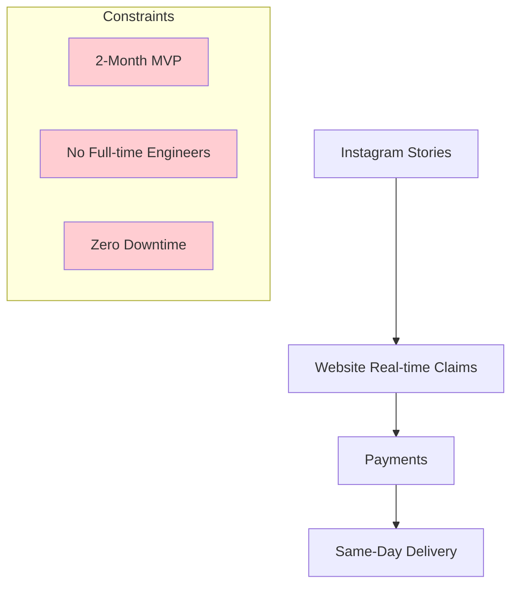
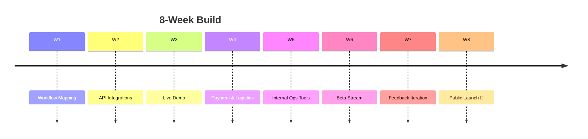
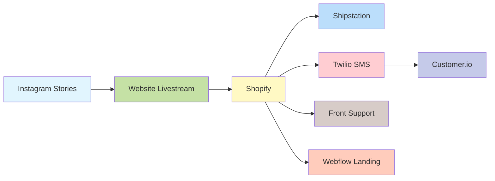

## Livestream commerce, same-day delivery

**Riiu** turned pandemic-era bargain hunting into an engaging live shopping experience. Viewers joined livestreams, claimed luxury items in real-time, and received them at their door before the day ended.

  

    

      
    

    

      
    

    

      
    

    

      
    

    

      
    

  

  
  <button class="carousel-btn carousel-prev" onclick="changeSlide(-1)">&#10094;</button>
  <button class="carousel-btn carousel-next" onclick="changeSlide(1)">&#10095;</button>
  
  

    
    
    
    
    
  

---

## Challenge

Stitch an end-to-end commerce stack without writing a monolith. Marketing, SMS alerts, live sales, payments, and courier dispatch all working in harmony.

## Approach

1. **Low-code spine** – glued together best-of-breed SaaS via webhooks and serverless functions.
2. **Livescale** powered live video and inventory countdown on stream.
3. **Shopify** managed catalog & payments; **Shipstation** auto-printed labels.
4. **Twilio + Customer.io** pushed claim confirmations and delivery ETAs via SMS.
5. **Front** gave support agents instant context on every order.

## Outcome

- 🚀 **Speed to market** – concept to revenue in **60 days**.
- 💸 **Revenue-positive** from first week of broadcasts.
- 🙌 **98% positive feedback** on checkout speed and delivery reliability.

## Stack

## Want similar impact?

Fractional CTO engagement lets you ship faster without the full-time overhead.

📅 **[Book a free 30-min call](https://calendar.app.google/rVk4MYXfZTu6VHdP9)** to explore your roadmap.
